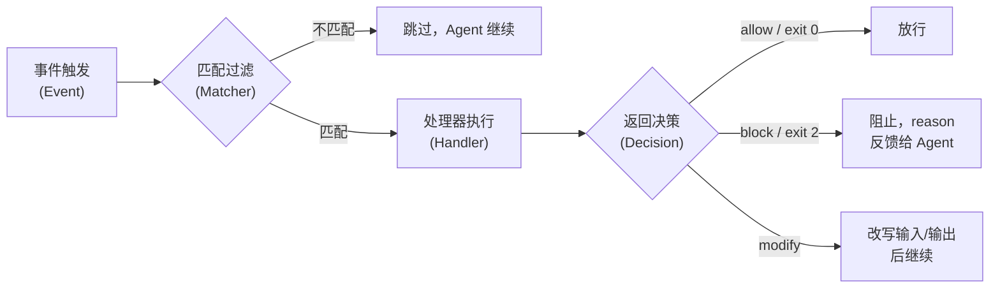

# Agent Hooks：生命周期钩子机制

> Hook 不驱动 Agent 行为，而是**验证、拦截、注入、观测** Agent 的每一步动作。核心价值：**将工程约束从自然语言提示（不可靠）转为代码执行（确定性）**。

---

## 1. 通用模型

不同产品/框架命名各异，但本质结构统一：

### Handler 类型

| 类型 | 机制 | 确定性 | 适用场景 |
|------|------|--------|----------|
| **Shell 命令** | exit code + stdout JSON 返回决策 | 高 | 规则明确的验证 |
| **HTTP 端点** | POST 到外部服务，响应体返回决策 | 高 | 集成外部系统（审计、CI、策略引擎） |
| **LLM Prompt** | 事件上下文发送给 LLM 做单轮判断 | 中 | 需要语义理解的验证 |
| **Agent** | 生成 subagent 来验证条件 | 低 | 需要读文件、搜索代码库才能判断 |

从 Shell 到 Agent，**确定性递减、能力递增**。实践中应优先使用确定性高的类型。

### Decision 控制

| 决策 | 效果 |
|------|------|
| **allow** / exit 0 | 放行 |
| **block** / exit 2 | 阻止当前操作，reason 反馈给 Agent |
| **deny** / **approve** | 拒绝 / 自动批准权限请求 |
| **modify** | 修改 Agent 的输入/输出后继续 |

---

## 2. 产品级实现

### Claude Code（最完整的参考实现）

覆盖 25+ 生命周期事件，涵盖会话管理、Agentic Loop（PreToolUse / PostToolUse / Stop 等）、Subagent 生命周期、Agent Teams、上下文压缩等阶段。事件全景和配置语法见官方文档[^anthropic-hooks-2026]，实战模式见 hooks guide[^anthropic-hooks-guide-2026]。

**设计上的关键决策**：

- **声明式 JSON 配置**：三层嵌套（事件 → 匹配器组 → 处理器），解决"如何让非开发者也能给 Agent 加约束"
- **多层作用域**：用户级 → 项目级 → 组织级（Managed policy），企业可通过 `allowManagedHooksOnly` 锁定只允许组织策略 hook
- **异步 Hook**：`async: true` 标记后台执行，不阻塞 Agent 循环，适用于日志/通知等无需决策反馈的场景
- **防死循环**：Stop hook 通过 `stop_hook_active` 标记实现递归退出——已被阻塞过一次就放行

### Devin

设计更精简。关键差异：hook 反馈直接注入对话流（作为用户消息），而非结构化的 JSON 决策。

### OpenAI Codex

不采用运行时 hook，而是通过环境结构化（`AGENTS.md` 声明约束 + Sandbox 安全边界 + 文档/测试/质量分数反馈）实现等效控制。

---

## 3. 框架级实现

| 框架 | 核心抽象 | 拦截粒度 | 文档 |
|------|----------|----------|------|
| **LangGraph** | BaseCallbackHandler（Python 类） | 工具级 + LLM 调用级 | [Callbacks][^langchain-docs] |
| **AutoGen** | `register_hook` 消息拦截器 | 消息级（发送前 / 回复前） | — |
| **CrewAI** | `step_callback` / `task_callback` | 任务级，粒度粗，无拦截能力 | — |

---

## 4. 设计哲学对比

| 维度 | 产品级（Claude Code / Devin） | 框架级（LangGraph / AutoGen / CrewAI） |
|------|------|------|
| 面向对象 | 终端用户 | 开发者 |
| 配置方式 | 声明式 JSON + 外部脚本 | Python 命令式 |
| 拦截机制 | JSON 决策（block/deny/approve/modify） | 抛异常 / 返回 None |
| 组织管控 | Managed policy + 企业锁定 | 无（开发者自建） |
| 关键权衡 | 确定性 > 灵活性 | 灵活性 > 确定性 |

---

## 5. 设计经验法则

1. **优先确定性**：能用 Shell 脚本解决的，不要用 LLM Prompt Hook
2. **防死循环**：Stop hook 必须有递归退出机制
3. **超时控制**：所有 Hook 设置合理的 timeout，避免阻塞 Agent
4. **最小权限**：Hook 脚本只访问它需要的信息，不暴露完整会话上下文
5. **Hook 是约束，不是驱动力**：不要用 Hook 替代 Agent 核心推理或多轮业务编排

---

## 参考资料

[^anthropic-hooks-2026]: Anthropic. "Hooks reference - Claude Code Docs". 2026. https://docs.anthropic.com/en/docs/claude-code/hooks
[^anthropic-hooks-guide-2026]: Anthropic. "Automate workflows with hooks". 2026. https://docs.anthropic.com/en/docs/claude-code/hooks-guide
[^langchain-docs]: LangChain. "Callbacks". https://python.langchain.com/docs/concepts/callbacks/
