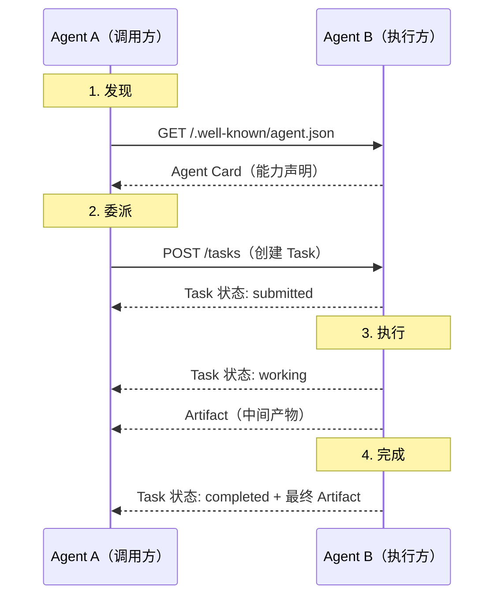

# Agent 间通信协议

> 当一个 Agent 的能力不够时，它需要找到另一个 Agent 并委派任务——这需要标准化的发现和通信协议。

与[工具协议](agent-tools.md)的区别：工具是"被调用的函数"，没有自主性；另一个 Agent 是"有自主决策能力的合作者"，能自行规划执行步骤。这一本质差异决定了 Agent 间协议需要处理**任务生命周期、进度通知、结果协商**等工具协议不需要的问题。

---

## 1. A2A（Agent-to-Agent Protocol）

Google 提出的 Agent 间通信协议[^a2a-spec]。

### 核心概念

| 概念 | 说明 |
|------|------|
| **Agent Card** | 能力声明（JSON），托管在 `/.well-known/agent.json`，包含名称、能力范围、输入输出格式、认证方式 |
| **Task** | 协作的基本单位，有完整生命周期 |
| **Artifact** | 任务的输出物（文本、文件、结构化数据），执行中可发送中间 Artifact |

### 交互流程

**关键设计**：

- **Task 生命周期**：`submitted → working → completed / failed`，调用方可随时查询状态
- **流式通信**：支持 SSE（Server-Sent Events），执行方可以实时推送进度和中间结果
- **不透明执行**：调用方不需要知道 Agent B 内部用了什么模型、什么工具——只关心输入和输出
- **Push Notification**：长时间任务可通过 webhook 回调通知调用方，避免轮询

### 与工具协议的边界

| 维度 | MCP（[工具协议](agent-tools.md)） | A2A |
|------|-----|-----|
| 交互对象 | Agent → 工具（被动执行） | Agent → Agent（自主决策） |
| 执行方 | MCP Server 按指令执行 | Agent 自行规划执行步骤 |
| 状态管理 | 无状态（调用-返回） | 有状态（Task 生命周期） |
| 发现机制 | 配置文件静态指定 | Agent Card 动态发现 |

---

## 2. ANX Protocol

开源 Agent 交互协议（2026.4），试图在四个维度统一现有方案：

- **工具使用（Tooling）**：统一 Function Calling 和 MCP 的工具描述格式
- **发现机制（Discovery）**：融合 A2A 的 Agent Card 概念
- **安全性（Security）**：内置认证和授权
- **多 Agent SOP 协作**：支持标准操作流程的 Agent 间编排

---

## 参考资料

[^a2a-spec]: Google. *Agent-to-Agent Protocol*. https://google.github.io/A2A/
