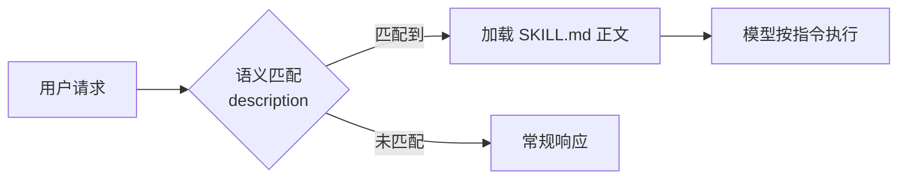

# Agent Skills

> [工具](agent-tools.md)告诉 Agent "能做什么"，Skill 告诉 Agent "遇到这类问题该怎么做"。

Agent Skills 最初由 Claude Code 提出并实现，随后 Anthropic 将其作为开放规范发布[^agent-skills-spec]，现已成为编码 Agent 领域的**事实标准**，被 Devin、Cursor、Windsurf 等主流产品采用。

---

## 核心问题

Function Calling 和 MCP 解决了工具的**调用**和**连接**，但没有解决一个更高层的问题：**如何将多个工具调用、上下文理解和领域知识组合成一个可复用的能力单元？**

传统做法是写代码——用编程语言把工具调用串联起来，处理分支和异常。Skills 的突破在于：用**自然语言**做同样的事。

---

## 1. 范式转换：从代码到自然语言

| 维度 | 工具（Tool / MCP） | Skill |
|------|-------------------|-------|
| 定义方式 | 代码（函数签名 + 实现） | 自然语言（Markdown 指令）+ 可选脚本 |
| 粒度 | 单一操作（读文件、查 API） | 复合工作流（代码审查、架构重构） |
| 执行者 | 宿主程序执行，模型只负责调用 | 模型自身执行，按指令编排多个工具 |
| 可组合性 | 低——工具之间相互独立 | 高——一个 Skill 可编排多个工具和[子 Agent](subagents.md) |
| 上下文成本 | **全量前置**——所有工具描述在启动时一次性注入上下文 | **渐进式**——启动时只加载摘要，按需加载完整指令 |
| 扩展方式 | 写代码、部署服务 | 写一份 Markdown，放进目录 |

这是一个重要的范式转换：**提示即能力定义**。Skill 的能力边界不由程序员显式编码，而由模型的理解和执行能力决定。

---

## 2. 规范结构

一个 Skill 是一个**目录**，包含必需的 `SKILL.md` 和可选的辅助资源[^agent-skills-spec]：

```
skill-name/
├── SKILL.md          # 必需：元数据 + 指令
├── scripts/          # 可选：可执行脚本
├── references/       # 可选：参考文档
└── assets/           # 可选：模板、数据文件
```

### SKILL.md 格式

由 YAML frontmatter + Markdown 正文两部分组成：

```yaml
---
name: deep-review
description: >
  Comprehensive code review. Use when reviewing staged
  changes before a commit or PR.
allowed-tools: Bash(git:*) Read
---
Run three parallel subagent reviews on the staged changes:
1. Security review — vulnerabilities, injection risks, auth issues
2. Performance review — N+1 queries, memory leaks, blocking operations
3. Style review — consistency with project patterns in /docs/style-guide.md
Synthesize findings into a single summary with priority-ranked issues.
```

### Frontmatter 字段

| 字段 | 必需 | 说明 |
|------|------|------|
| `name` | 是 | 唯一标识，小写字母+数字+连字符，≤64 字符，须与目录名一致 |
| `description` | 是 | 描述功能和触发时机，≤1024 字符——**直接决定语义匹配准确率** |
| `allowed-tools` | 否 | 预授权工具白名单（实验性），如 `Bash(git:*) Read` |
| `compatibility` | 否 | 环境要求（目标产品、系统依赖等） |
| `metadata` | 否 | 任意键值对，用于扩展属性（作者、版本等） |
| `license` | 否 | 许可证声明 |

### 辅助目录的设计意图

| 目录 | 用途 | 加载时机 |
|------|------|----------|
| `scripts/` | 可执行代码（Python/Bash/JS） | 执行阶段按需调用 |
| `references/` | 补充文档、技术参考 | 执行阶段按需读取 |
| `assets/` | 模板、数据文件、Schema | 执行阶段按需读取 |

这意味着 Skill 不只是一份 Markdown 指令——它可以**捆绑可执行代码和参考资料**，形成完整的能力包。

---

## 3. 核心机制：渐进式上下文加载

Skill 规范中最重要的技术设计是 **Progressive Disclosure**（渐进式披露）——分三层加载，精确控制上下文成本：


| 阶段 | 加载内容 | Token 预算 | 时机 |
|------|----------|-----------|------|
| **发现** | 所有 Skill 的 `name` + `description` | 每个 ~100 tokens | Agent 启动时 |
| **激活** | 被选中 Skill 的 SKILL.md 正文 | 建议 < 5000 tokens | 任务匹配时 |
| **执行** | scripts/、references/、assets/ 中的文件 | 按需 | 指令引用时 |

**设计动机**：Tool / MCP 的上下文成本是**全量前置**的——Agent 启动时，每个工具的完整 JSON Schema（函数名、参数类型、枚举值、嵌套对象、描述文本）全部注入系统提示。JSON Schema 天然冗长，一个中等复杂度的工具定义轻松占 200–500 tokens；连接 10 个 MCP Server、暴露 50 个工具，仅工具描述就可能吃掉上万 tokens——而对话还没开始。工具越多，留给推理的上下文空间越小，这构成了工具规模的硬性天花板。

以一个"搜索文件"工具为例，感受 JSON Schema 的膨胀：

```json
{
  "name": "grep",
  "description": "Search for patterns in files using regex.",
  "input_schema": {
    "type": "object",
    "properties": {
      "pattern": {
        "type": "string",
        "description": "The regex pattern to search for."
      },
      "path": {
        "type": "string",
        "default": ".",
        "description": "The directory or file to search in."
      },
      "case_insensitive": {
        "type": "boolean",
        "default": false,
        "description": "Perform case-insensitive search."
      },
      "max_results": {
        "type": "integer",
        "default": 100,
        "description": "Maximum number of matches to return."
      }
    },
    "required": ["pattern"]
  }
}
```

仅这**一个**工具就约 120 tokens。一个典型 Agent 会配置 20–50 个这样的工具，Schema 总量轻松破万 tokens。

工具膨胀问题催生了两种不同方向的解法：

| 方向 | 思路 | 代表 |
|------|------|------|
| **向上抽象** | 用自然语言摘要替代 JSON Schema，按需加载 | Agent Skills（本文主题） |
| **向下收敛** | 与其定义 50 个专用工具，不如只给一个 `bash` | "Bash is all you need"（见下一章） |

Skills 用渐进式加载打破了这个瓶颈：启动时只付出每个 Skill ~100 tokens 的摘要成本（`name` + `description`，纯自然语言，无 Schema 膨胀），完整指令仅在匹配命中时才加载。50 个 Skill 的发现成本约 5000 tokens，而同等数量的工具 JSON Schema 可能需要数万 tokens。

---

## 4. 另一种思路："Bash is All You Need"

面对同样的工具膨胀问题，社区中还有一种更激进的解法：**不要定义那么多工具，给模型一个 shell 就够了**。

### 核心论点

与其为每个操作定义一个带 JSON Schema 的专用工具（`grep`、`find_file`、`git_diff`、`run_test`……），不如只提供一个 `bash` 工具，让模型自己用 shell 命令组合出任意能力。

| 方案 | 工具数量 | Schema 总成本 | 能力覆盖 |
|------|----------|--------------|----------|
| 专用工具 | 20–50 个 | 数千至上万 tokens | 有限——只能做预定义的操作 |
| Bash + 少量文件操作 | 3–5 个 | 几百 tokens | 几乎无限——整个 CLI 生态 |

模型的训练数据中包含了海量的 shell 用法（`git`、`curl`、`jq`、`sed`、`awk`、`docker`……），它"天然会用"这些工具。一个 `bash` 工具的 Schema 只有几十 tokens，却覆盖了几乎无限的操作空间。

### 产品实践

头部编码 Agent 的工具设计印证了这一思路：

**Claude Code** 的内置工具只有五类：文件操作、搜索、Shell 执行、Web 访问、代码智能[^claude-code-tools]。其中 Shell 执行（Bash）是最通用的——官方文档直言："Any command you could run: build tools, git, package managers, system utilities, scripts. If you can do it from the command line, Claude can too."

**OpenAI Codex** 走得更远：Agent 运行在沙箱 microVM 中，核心交互方式就是 shell 命令执行。工具集极简，依赖模型的 shell 能力完成几乎所有操作。

### 权衡

| 优势 | 代价 |
|------|------|
| 彻底消灭 Schema 膨胀 | 丧失类型安全和参数校验 |
| 能力覆盖几乎无限 | 模型需要足够强的 shell 编程能力 |
| 符合 Unix 哲学：组合简单原语 | 复杂操作可能需要多步 shell 命令，增加出错概率 |
| Agent 框架实现更简单 | 安全控制更难——需要沙箱或细粒度命令白名单 |

### 与 Skills 的结合

两种思路并不互斥——事实上 Skill 的 `scripts/` 目录和 `allowed-tools: Bash(...)` 字段正是二者的结合：**用 Skill 做高层编排和语义路由，用 bash 做底层执行**。这可能是目前最务实的架构选择。

---

## 5. 语义触发

Skill 的分发是**语义匹配**的，不是按名称精确调用。模型读取所有可用 Skill 的 `description` 字段，根据用户请求的语义自动选择最相关的 Skill。



这意味着 `description` 的写法直接决定触发准确率——本质上是 [prompt engineering](prompt-engineering.md) 问题。规范建议 description 应同时描述**做什么**和**何时用**，并包含具体关键词帮助匹配。

### 与其他机制的协作

| 协作方 | 关系 |
|--------|------|
| [工具 / MCP](agent-tools.md) | Skill 编排工具——Skill 决定"何时用什么工具"，工具负责执行 |
| [子 Agent](subagents.md) | Skill 可启动子 Agent 做并行或分阶段任务 |
| [Hooks](agent-hooks.md) | Hooks 可对 Skill 触发的工具调用做运行时拦截和验证 |
| [记忆系统](memory-systems.md) | Skill 可引用持久化记忆中的领域知识 |

---

## 6. 采用情况

Agent Skills 由 Anthropic 最初开发后作为开放标准发布，正被越来越多的 Agent 产品采用[^agent-skills-spec]。

| 产品 | 机制 | 路径约定 | 成熟度 |
|------|------|----------|--------|
| **Claude Code** | Skills | `.claude/skills/<name>/SKILL.md` | 最完整——支持 frontmatter、子 Agent 编排、工具白名单 |
| **Devin** | Skills | `.cognition/skills/<name>/SKILL.md` | 兼容 Agent Skills 规范 |
| **Cursor** | Rules | `.cursor/rules/*.md` | Proto-skill：可按文件模式触发规则，但无子 Agent 编排 |
| **Windsurf** | Rules | `.windsurf/rules/*.md` | 类似 Cursor Rules |

**收敛趋势**：从 "Rules"（静态规则注入）到 "Skills"（语义触发 + 工作流编排），核心演进是从"告诉模型注意什么"到"告诉模型遇到特定问题该怎么解决"。开放规范的推出加速了这一收敛——Skill 作者写一次，可跨产品复用。

---

## 7. 设计权衡

| 权衡 | 说明 |
|------|------|
| **灵活性 vs 可控性** | 自然语言定义灵活但不如代码工具确定性高——模型可能"创造性发挥"偏离指令 |
| **上下文成本** | 渐进式加载缓解了问题，但激活的 Skill 仍占用上下文窗口；规范建议单个 SKILL.md < 500 行 |
| **调试难度** | 工具调用失败有明确的错误码；Skill 执行偏差更难定位，因为中间过程是模型的自由推理 |
| **Skill 与 Agent 的边界** | 一个足够复杂的 Skill 本质上就是一个[子 Agent](subagents.md) 的定义——两者的边界是模糊的 |
| **可移植性 vs 产品特性** | 开放规范保证基础可移植性，但 `allowed-tools` 等字段的支持程度因产品而异 |

---

## 8. 演进脉络

```
Rules（静态注入）→ Skills（语义触发 + 编排）→ ?
```

Rules 是 Skills 的前身：它们都是 Markdown 文件，都注入上下文，但 Rules 靠文件路径模式匹配，Skills 靠语义匹配。下一步可能的方向是 Skill 之间的**动态发现和组合**——类似 [Agent 间协议](agent-protocols.md)中 Agent Card 的机制，但粒度更细。

---

## 参考资料

[^agent-skills-spec]: Agent Skills. *Agent Skills Specification*. https://agentskills.io/
[^claude-code-tools]: Anthropic. *How Claude Code works — Tools*. https://docs.anthropic.com/en/docs/claude-code/how-claude-code-works#tools
