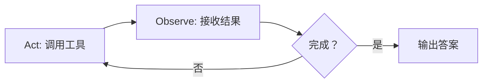
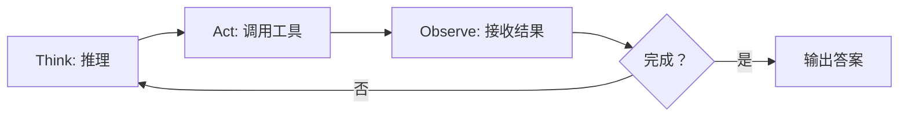
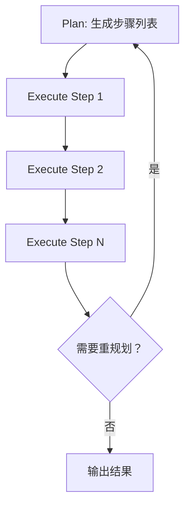
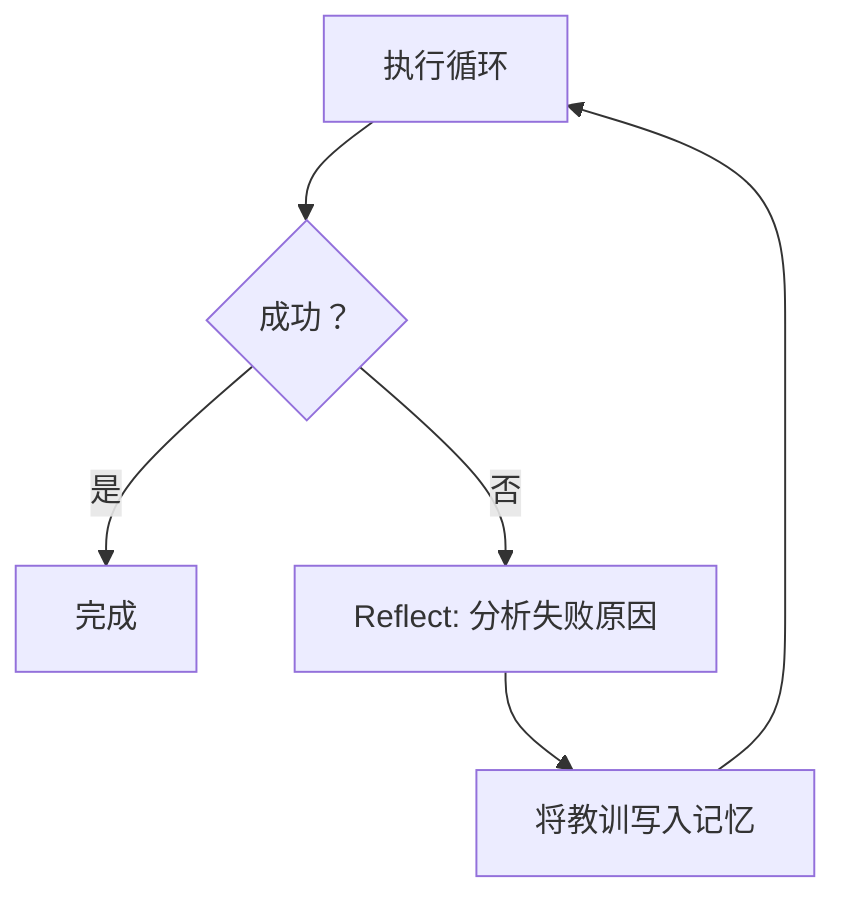

# AI Agent 智能体

> Agent 的本质不是"一个聪明的模型"，而是**一个循环**——让 LLM 反复经历"思考 → 行动 → 观察"直至任务完成。

---

## 1. 核心公式

```
Agent = LLM（推理引擎）+ 循环（执行框架）+ 工具（外部能力）+ 记忆（状态持久化）
```

关键区分：**LLM 是无状态的函数调用，Agent 是有状态的循环系统。** 单次 LLM 调用只做推理；Agent 的价值在于将推理嵌入一个持续运转的执行循环中，让模型能根据环境反馈不断修正行为。

---

## 2. 最简 Agent 循环

先看最朴素的 Agent 循环长什么样。以"查天气"为例——用户问"北京今天天气怎么样？"，Agent 需要调用天气 API 才能回答：

```
[System Prompt] 你是一个天气助手。调用工具获取实时数据后回答，不要编造。
[Tools]         get_weather(city, date) — 查询指定城市的天气

用户: 北京今天天气怎么样？

── 循环第 1 轮 ──────────────────────────
[Act]     调用 get_weather("北京")
[Observe] 返回：晴，最高 25°C，最低 14°C
[判断]    已拿到所需信息 → 退出循环

Agent: 北京今天晴，最高 25°C，最低 14°C。
```

这就是 Agent 循环的最小形态——**Act → Observe → 判断是否结束**：



再看一个需要多轮的例子——"对比北京和上海明天的天气"：

```
── 循环第 1 轮 ──────────────────────────
[Act]     调用 get_weather("北京", "明天")
[Observe] 返回：多云，22°C / 13°C

── 循环第 2 轮 ──────────────────────────
[Act]     调用 get_weather("上海", "明天")
[Observe] 返回：小雨，19°C / 15°C
[判断]    两个城市数据都拿到了 → 退出循环

Agent: 明天北京多云 22°C，上海小雨 19°C。北京更暖和且不下雨。
```

循环的价值就体现出来了：**一次 LLM 调用搞不定的事，多轮迭代就能搞定。**

但这个朴素循环有几个明显的短板：

| 短板 | 表现 |
|------|------|
| 没有显式推理 | LLM 直接跳到行动，为什么选这个工具、传这些参数？看不到思考过程，出错了难以排查 |
| 没有全局规划 | 每一轮都从头推理"接下来干什么"，遇到 10 步任务就产生大量重复推理，浪费 token |
| 不会从失败中学习 | 如果某一轮调用失败，只能盲目重试，不会总结"为什么失败"来指导下次尝试 |

以下三种经典架构分别解决这三个短板。

---

## 3. 循环的三种优化

### 3.1 ReAct：加入显式推理

ReAct（Reasoning + Acting）[^yao-2022-react]在每轮 Act 之前插入一个 **Think** 步骤——让模型先把推理过程写出来，再决定行动：

```
用户: 北京今天天气怎么样？

── 循环第 1 轮 ──────────────────────────
[Think]   用户问的是实时天气，我需要调用天气工具，参数是城市="北京"
[Act]     调用 get_weather("北京")
[Observe] 返回：晴，最高 25°C，最低 14°C
[判断]    已拿到所需信息 → 退出循环

Agent: 北京今天晴，最高 25°C，最低 14°C。
```



**解决了什么**：推理过程可见了。Think 步骤暴露了模型的决策逻辑——为什么选这个工具、传什么参数、当前离目标还差多远。出错时可以直接定位是"想错了"还是"做错了"。

### 3.2 Plan-and-Execute：先规划后执行

当任务有多个步骤时，ReAct 每一轮都重新推理"接下来干什么"，开销高且容易在中途偏离目标。Plan-and-Execute 的思路是**先用一次推理生成完整计划，再逐步执行**：

```
用户: 帮我规划一个北京三日游

── 规划阶段 ──────────────────────────
[Plan]  1. 搜索北京热门景点
        2. 查询各景点开放时间和门票
        3. 根据地理位置规划每日路线
        4. 查询天气，调整户外行程

── 执行阶段 ──────────────────────────
[Execute Step 1] 搜索北京热门景点 → 故宫、长城、颐和园...
[Execute Step 2] 查询开放时间 → ...
[Execute Step 3] 规划路线 → ...
[Execute Step 4] 查询天气 → 第2天有雨，将长城换到第3天
[判断]  所有步骤完成 → 输出行程
```



**解决了什么**：规划一次，执行 N 步。不用每步都重新推理全局目标，token 效率高，适合步骤明确的结构化任务。权衡是灵活性下降——如果中途发现计划不对，需要显式的重规划机制。

| | ReAct | Plan-and-Execute |
|---|---|---|
| 决策方式 | 逐步推理 | 先规划后执行 |
| 适合场景 | 探索性任务、信息不完整 | 步骤明确的结构化任务 |
| token 效率 | 每步都重新推理，开销高 | 规划一次，执行轻量 |
| 容错 | 自然适应，每步都能调整 | 需要显式重规划机制 |

### 3.3 Reflexion：从失败中学习

前两种模式在单轮循环内能处理错误（观察到报错 → 换个方式重试），但如果整个任务失败需要从头再来，之前的经验就丢了——每次重启都是白纸一张。Reflexion[^shinn-2023-reflexion]在执行循环**外面**再套一层反思循环——失败后先总结"为什么失败"，把教训写进记忆，下次执行时带上这些教训：

```
── 第 1 次尝试 ──────────────────────────
[执行 ReAct 循环] → 失败（测试未通过）
[Reflect] 失败原因：没有处理空列表的边界情况
[写入记忆] "注意：该函数需要处理空列表输入"

── 第 2 次尝试（带着记忆重来）──────────
[执行 ReAct 循环] → 成功 ✓
```



**解决了什么**：Agent 级别的"经验学习"。不是随机重试，而是**结构化地提取失败经验**，让每次重试都比上次更聪明。

---

## 4. 循环中的关键机制

### 4.1 工具调用

循环的 Act 步骤依赖工具调用能力。现代 Agent 通过 [Function Calling 或 MCP](agent-tools.md) 调用工具，或通过 [Agent Skills](agent-skills.md) 编排复合工作流，工具的输出成为下一轮 Observe 的输入。

### 4.2 状态管理与 Context Compact

每一轮循环都在累积上下文——工具调用的参数和返回值、推理过程、中间结果，全部堆在同一个上下文窗口里。长期状态靠[记忆系统](memory-systems.md)持久化。

当上下文逼近窗口上限时，有两种应对策略：

| 策略 | 思路 | 适用场景 |
|------|------|---------|
| **Context Compact** | 让模型将已有上下文压缩为一段摘要，丢弃原始细节，循环带着摘要继续跑 | 单 Agent 长任务——上下文快满了但任务还没做完，压缩后还能继续 |
| **Subagent 隔离** | 将子任务分发到独立上下文中执行，只回传结果摘要 | 可并行的多步任务——每个子循环的上下文互不污染，详见 [Subagent 实践](subagents.md) |

Context Compact 的典型流程：上下文占用超过阈值（如 70%）→ 触发压缩 → 模型生成当前进度的结构化摘要（已完成什么、待完成什么、关键中间结果）→ 用摘要替换原始上下文 → 循环继续。代价是**丢失细节**——被压缩掉的早期推理过程和工具输出无法再回溯。

### 4.3 终止条件

循环何时停止是一个不平凡的问题——停得太早，任务没做完；停得太晚，浪费 token 甚至造成破坏。

| 策略 | 触发方式 | 权衡 |
|------|---------|------|
| **模型自主终止** | 模型判断任务完成，输出 `finish` 动作或直接给出最终答案 | 最自然，但模型可能误判（以为完成了实际没完成，或陷入"我再优化一下"的死循环） |
| **资源熔断** | 达到预设的最大步数、token 上限或超时时间，强制停止 | 兜底保障，防止失控。但上限设多少是个经验值——太低会截断正常任务，太高则失去保护意义 |
| **人类介入** | 用户主动中断（Ctrl+C、取消按钮） | 最灵活，但要求人一直盯着。适合交互式场景，不适合后台 Agent |
| **策略拦截** | [Hook](agent-hooks.md) 检测到特定条件后终止（如即将执行危险操作、连续 N 轮无进展） | 可编程的精细控制，能表达"删除文件前必须确认"、"连续 3 轮输出相同则终止"等业务规则 |

实践中这四种策略通常叠加使用：模型自主终止是主路径，资源熔断做兜底，Hook 拦截关键操作，人类保留最终中断权。

---

## 5. 从单循环到多循环

单 Agent 的能力天花板受限于单一上下文窗口和串行执行。突破方式是将多个循环组合：

| 模式 | 核心思路 | 详见 |
|------|---------|------|
| **Subagent** | 主循环分发任务给子循环，子循环独立执行后回传结果 | [Subagent 实践](subagents.md) |
| **多 Agent 协作** | 多个独立循环通过消息传递协作 | [AutoGen](../agent-frameworks/autogen.md) 对话模式 |
| **管道式** | 循环串联，上一个输出作为下一个输入 | [CrewAI](../agent-frameworks/crewai.md) Sequential |
| **层级式** | Manager 循环调度 Worker 循环 | OpenAI Symphony[^latentspace-2026-harness] |

> 多循环系统的详细架构和各产品实现对比见 [Subagent 实践](subagents.md)。

---

## 6. 安全与约束

Agent 循环的自主性带来安全风险——循环可能失控（无限执行）、越权（工具滥用）、被操纵（提示注入）。

| 风险 | 循环中的位置 | 缓解机制 |
|------|------------|---------|
| 无限循环 | 终止条件失效 | 最大步数限制、超时机制 |
| 工具滥用 | Act 步骤 | 权限策略、[Hook 拦截](agent-hooks.md)、沙箱执行 |
| 提示注入 | Observe 步骤（外部输入污染） | 输入清洗、权限隔离 |
| 信息泄露 | Act 步骤（向外发送数据） | 网络策略、输出过滤 |

> 详细的安全研究与治理框架见 [AI 安全与治理](../research/safety-and-governance.md)。NVIDIA OpenShell 的沙箱方案见 [NeMo Agent Toolkit](../agent-frameworks/nemo-agent-toolkit.md)。

---

## 7. 趋势：循环的进化方向

- **长运行持久循环**：Agent 从"一次性任务"走向"持续运行的守护进程"。Springdrift（2026.4 arXiv）提出可审计的持久运行时，具备案例记忆、规范性安全保障和环境自我感知
- **Harness Engineering**[^latentspace-2026-harness]：当 Agent 循环失败时，不是优化 prompt，而是问"循环缺什么能力/上下文/结构？"然后补全之。OpenAI 的 Dark Factory 模式（>100 万行代码库、~10 亿 token/天、0% 人工参与）验证了这一思路
- **自主计算机使用**：循环的 Act 步骤从 API 调用扩展到 GUI 操控——Agent 直接操作屏幕完成任务（Claude Computer Use、Browser Agent）。浏览器场景的技术方案见 [AI 浏览器自动化](browser-automation.md)

---

## 相关文档

| 主题 | 链接 |
|------|------|
| 记忆系统 | [Agent 记忆系统](memory-systems.md) |
| 工具接入 | [Agent 工具接入](agent-tools.md) |
| Agent Skills | [Agent Skills](agent-skills.md) |
| Agent 间协议 | [Agent 间通信协议](agent-protocols.md) |
| Agent 框架 | [框架档案](../agent-frameworks/index.md) |
| 生命周期钩子 | [Agent Hooks](agent-hooks.md) |
| Subagent 架构 | [Subagent 实践](subagents.md) |
| 编码 Agent 产品 | [产品档案](../coding-agents/index.md) |

---

## 参考资料

[^yao-2022-react]: Yao et al. *ReAct: Synergizing Reasoning and Acting in Language Models*. 2022. https://arxiv.org/abs/2210.03629
[^shinn-2023-reflexion]: Shinn et al. *Reflexion: Language Agents with Verbal Reinforcement Learning*. 2023. https://arxiv.org/abs/2303.11366
[^latentspace-2026-harness]: Latent Space. "Extreme Harness Engineering for Token Billionaires — Ryan Lopopolo, OpenAI Frontier & Symphony". 2026. https://www.latent.space/p/harness-eng
