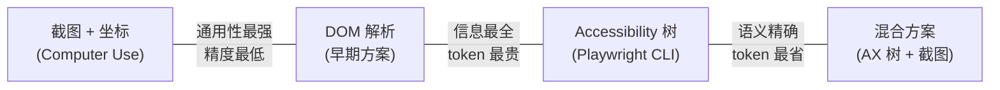
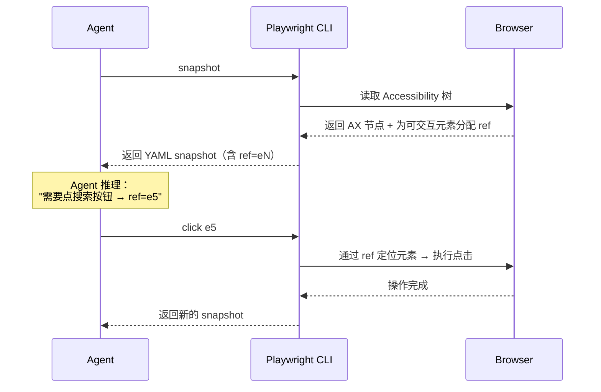

# AI 浏览器自动化

> Agent [执行循环](ai-agents.md)的 Act 步骤从 API 调用扩展到浏览器操控时，首要问题不是"怎么点击"，而是**"怎么让 LLM 看懂网页"**。Playwright CLI 的 snapshot 格式是当前最具工程价值的回答。

---

## 1. 核心问题：网页表示

一个网页同时存在多种形态：

| 形态 | 规模 | 特点 |
|------|------|------|
| 像素（截图） | ~1,500–3,000 tokens/张 | 人直觉友好，但 LLM 无法精确定位元素 |
| DOM 树（HTML） | ~10K–100K+ 节点 | 结构完整，但冗余极高——大量 `<div>` 嵌套、`<script>`、CSS class 对 LLM 无意义 |
| Accessibility 树 | ~100–2,000 节点 | 语义压缩——只保留角色、名称和可交互属性，50x 压缩比 |

**根本权衡**：信息量 vs. token 效率。DOM 什么都有但太贵；截图直观但无法精确操作；Accessibility 树恰好在中间——保留了"这是什么、叫什么、能做什么"的语义信息，丢掉了视觉布局和实现细节。

---

## 2. 四种技术路线对比



| 维度 | 截图 + 坐标 | DOM 解析 | Accessibility 树 | 混合（AX + 截图） |
|------|------------|---------|------------------|------------------|
| tokens/步 | 1,500–3,000 | 5,000–50,000+ | 500–3,000 | 2,000–5,000 |
| 元素定位精度 | 低（~10–20px 误差） | 高 | 高 | 高 |
| 速度/步 | 3–6s（含视觉推理） | 2–4s | 1–3s | 3–6s |
| 适用范围 | 任意应用（桌面、终端） | 仅浏览器 | 仅浏览器 | 仅浏览器 |
| 对站点变更的鲁棒性 | 高（视觉相似即可） | 低（DOM 结构常变） | 中（语义标签较稳定） | 中高 |
| 是否需要视觉模型 | 是 | 否 | 否 | 是（截图部分） |

**关键洞察**：截图方案是唯一能逃离浏览器的路线（Anthropic Computer Use 可以操控整个桌面），但在浏览器场景下，Accessibility 树在 token 效率和操作精度上完胜。

---

## 3. Playwright CLI Snapshot：核心格式

Playwright CLI[^pw-cli] 读取浏览器的 Accessibility 树，输出一种专为 AI Agent 设计的 YAML 格式——这就是 CLI snapshot。

> **不要和 Playwright ARIA Snapshot 混淆。** Playwright 测试框架有一个同名但完全不同的功能——`toMatchAriaSnapshot()`[^pw-aria-snapshot]，用于将页面结构与预定义模板做**确定性断言**。它不含 `ref`、不支持增量 diff、不输出 `/url:` `/placeholder:` 等伪子节点。Playwright CLI 的 snapshot 是独立的 AI-facing 格式：内部以 `mode: "ai"` 调用 `incrementalAriaSnapshot()`，为每个可交互元素分配 `ref` 句柄，附加运行时状态（`[active]`、`/placeholder:`），并支持跨步骤的增量 diff。两者只是碰巧都基于 Accessibility 树——设计目标、输出格式、使用场景完全不同。

### 3.1 格式规范

每个节点表示为：

```
- role "name" [attribute=value]
```

- **role**：ARIA 角色（`button`、`link`、`textbox`、`heading`、`list`...），来自 HTML 语义或显式 ARIA 标注
- **"name"**：Accessible Name，即屏幕阅读器会朗读的名字
- **[attribute=value]**：ARIA 状态属性（`checked`、`disabled`、`expanded`、`level`、`selected`...）

一个真实页面的 snapshot 示例：

```yaml
- banner:
    - heading "Example Domain" [level=1]
    - navigation "Main":
        - link "Home" [ref=e1]
        - link "Products" [ref=e2]
        - link "About" [ref=e3]
- main:
    - heading "Welcome" [level=2]
    - textbox "Search" [ref=e4]
    - button "Go" [ref=e5]
    - list:
        - listitem:
            - link "Product A — $29.99" [ref=e6]
        - listitem:
            - link "Product B — $49.99" [ref=e7]
- contentinfo:
    - text: "© 2026 Example Inc."
```

**设计要点**：

- **缩进 = 层级**：树形嵌套用 YAML 缩进表示，LLM 天然能理解层级关系
- **ref 标识符**：每个可交互元素携带 `[ref=eN]`，Agent 后续操作直接引用此 ref（如 `click ref=e5`），无需 CSS 选择器
- **文本内容**：非交互节点的文本直接内联（`text: "..."`），不生成 ref——只有能"做事"的元素才需要标识符

### 3.2 为什么是 Accessibility 树

Accessibility 树是浏览器引擎维护的**语义平行结构**——它和 DOM 共存，但只保留"对使用者有意义"的信息：

| 特性 | DOM 树 | Accessibility 树 |
|------|--------|-----------------|
| 维护者 | 浏览器渲染引擎 | 浏览器无障碍引擎 |
| 节点数 | 10K–100K+ | 100–2,000 |
| 包含内容 | 所有 HTML 元素、属性、嵌套 | 只有语义角色、名称、状态 |
| 隐藏元素 | 存在 | 自动过滤（`display:none`、`aria-hidden`） |
| 交互信息 | 需要推断（看 tag + event listener） | 直接标注（`role=button` 即可点击） |
| 动态同步 | 本体 | 浏览器引擎自动与 DOM 同步 |

**核心优势**：浏览器已经替你做了"哪些元素重要、它能做什么"的过滤和语义标注。你不需要自己写 JavaScript 去遍历 DOM 判断可见性和可交互性。

### 3.3 局限性

| 局限 | 表现 | 影响 |
|------|------|------|
| 缺失视觉上下文 | 无法区分"侧边栏 vs 主内容区" | 需要截图辅助的场景仍需混合方案 |
| 依赖无障碍标注 | 标注差的网站 → 树不完整 | 自定义 React/Vue 组件如果没有 ARIA 标注，在树中不可见 |
| Canvas / WebGL | 完全不可见 | 地图、图表、游戏等无法操作 |
| 跨域 iframe | 被安全策略阻断 | 嵌入的第三方内容可能缺失 |

---

## 4. Ref 交互模型

snapshot 中的 `ref` 是 Agent 与页面元素之间的**稳定句柄**。

### 工作流程



### 元素标识策略对比

不同方案用不同方式让 LLM "指认"要操作的元素：

| 策略 | 示例 | 优势 | 劣势 |
|------|------|------|------|
| 坐标 | `click(450, 320)` | 通用（任意应用） | 精度差，布局变了就失效 |
| 数字索引 | `click([5])` | 简洁 | 索引跨步骤不稳定，每次 snapshot 重新编号 |
| ref 标识 | `click(ref=e5)` | 在同一页面内稳定 | 页面导航后重新分配 |
| CSS 选择器 | `click("button.submit")` | 最精确 | 最脆弱——class 名常变 |
| ARIA 角色+名称 | `click(role=button, name="Submit")` | 语义稳定 | 名称重复时歧义 |

Playwright CLI 同时支持 ref 和 CSS 选择器/Playwright locator 作为后备，让 Agent 可以在 ref 不可用时退化到选择器。

**ref → locator 解析**：内部实现上，`ref=e29` 通过 Playwright 自定义的 `aria-ref=e29` 选择器引擎映射回 DOM 元素，并自动生成等价的语义 locator（如 `getByRole('textbox', { name: 'Email Address' })`）。这意味着 ref 不仅用于即时操作，也是代码生成的桥梁——Agent 用 ref 交互，系统同时输出可复用的 Playwright 测试代码。

---

## 5. Token 优化策略

AX 树已经比 DOM 紧凑 50 倍，但对于复杂页面仍可能很大。Playwright CLI 提供的进一步压缩手段：

| 策略 | CLI 命令 | 效果 |
|------|---------|------|
| **深度限制** | `snapshot --depth=4` | 只展开树的前 N 层，深层节点折叠 |
| **局部 snapshot** | `snapshot e34` 或 `snapshot "#main"` | 只捕获某个子树，忽略页面其余部分 |
| **文件落盘** | `snapshot --filename=page.yml` | snapshot 不进入 LLM 上下文，Agent 按需读取 |
| **不可见过滤** | （内置） | 浏览器引擎自动排除 `display:none`、`aria-hidden` 的元素 |
| **增量 diff** | （MCP 模式内置） | 初次返回完整树，后续只返回变化部分 |

**增量 snapshot 机制**：MCP Server 内部同时维护 `full`（完整树）和 `incremental`（diff）两个版本。首次交互返回完整 snapshot，后续每次工具调用只返回发生变化的子树（如按钮状态改变、新内容出现），未变化的部分不重复传输。这在多步操作（如填表 → 提交 → 确认）场景下显著节省 token。

**经验法则**：先用 `--depth=3` 拿到页面骨架，定位目标区域后再用 `snapshot <ref>` 展开局部子树。这类似于人看网页的方式——先扫一眼整体布局，再聚焦到具体区域。

---

## 6. 更广的技术全景

Playwright CLI 的 snapshot 是一种**确定性变换**——从 AX 树到 YAML，中间没有 LLM 参与。其他方案则在表示层引入了 LLM，形成了两条不同的技术路线。

### 6.1 确定性表示 vs LLM 介入表示

| | 确定性表示（Playwright CLI） | LLM 介入表示（Stagehand、Browser Use） |
|---|---|---|
| **表示层** | AX 树 → YAML，规则固定 | DOM/AX 树 → LLM 处理 → 结构化输出 |
| **可预测性** | 同一页面永远输出相同 snapshot | 同一页面可能因 LLM 推理差异输出不同结果 |
| **token 成本** | 仅行动步骤消耗 LLM token | 表示步骤也消耗 LLM token（双重开销） |
| **语义理解** | 无——原样呈现 AX 树，LLM 自行推理 | 有——LLM 先"理解"页面，再输出精炼结果 |
| **适用场景** | 结构化页面、表单、导航 | 复杂页面需要"看懂"内容才能操作的场景 |

### 6.2 各方案技术路线

**Stagehand**[^stagehand]（Browserbase）——LLM 深度介入的代表：

- 三原语 API：`observe()`（发现可操作元素）、`act()`（执行操作）、`extract()`（提取结构化数据）
- `observe()` 的核心流程：将 DOM 分 chunk → 每个 chunk 送 LLM 识别可操作元素 → 返回 XPath + 描述 + 建议操作。本质上是**用 LLM 做了一次页面摘要**，替代了 Playwright CLI 的确定性 AX 树提取
- 动作缓存：首次 `observe()` 的结果可缓存，后续重放时跳过 LLM 推理（`cacheStatus: "HIT"`），兼顾灵活性和效率
- 自愈机制：当网站结构变化导致缓存失效时，自动重新调用 LLM 识别元素

**Browser Use**[^browser-use]——自建 DOM 树 + 专用模型：

- 注入 `buildDomTree.js` 遍历 DOM，构建混合表示（AX 角色 + CSS 可见性启发式 + 交互检测），为元素分配数字索引 `[N]`
- 可选的彩色边框叠加层：在页面上为每个可交互元素画编号框，截图后与文本表示一并送入 LLM
- 专用微调模型 `ChatBrowserUse`（`bu-30b-a3b-preview`，30B 参数）：针对浏览器自动化任务微调，号称比通用模型快 3–5x

**Anthropic Computer Use**[^anthropic-cu]——纯视觉路线：

- 截图 + 坐标操作，唯一能逃离浏览器的方案——操控整个桌面环境，通过 VNC + `xdotool` 执行
- 无结构化页面表示，完全依赖视觉模型理解截图内容

**Set-of-Mark**[^som]——视觉增强：

- 在截图上为所有可交互元素叠加编号边框，直接启发了 Browser Use 的视觉叠加设计

### 6.3 趋势

领域尚未收敛到单一路线：

- **Coding Agent 场景**（大代码库 + 浏览器）倾向 Playwright CLI 的确定性路线——token 预算紧张，需要可预测的输出
- **独立浏览器 Agent 场景**（探索性自动化、复杂交互）倾向 Stagehand / Browser Use 的 LLM 介入路线——需要"理解"页面语义才能行动
- **专用模型**是新方向——Browser Use 的 `ChatBrowserUse` 将通用 LLM 的浏览器操作能力抽离为专用小模型，token 更便宜、延迟更低

---

## 参考资料

[^pw-cli]: Microsoft. *Playwright CLI with SKILLS*. https://github.com/microsoft/playwright-cli
[^pw-aria-snapshot]: Playwright. *Snapshot testing — Aria snapshots*. https://playwright.dev/docs/aria-snapshots
[^anthropic-cu]: Anthropic. *Computer Use Demo*. https://github.com/anthropics/anthropic-quickstarts/tree/main/computer-use-demo
[^browser-use]: Browser Use. *Browser Use — AI Browser Automation*. https://github.com/browser-use/browser-use
[^stagehand]: Browserbase. *Stagehand — AI Web Browsing Framework*. https://github.com/browserbase/stagehand
[^som]: Yang et al. *Set-of-Mark Prompting Unleashes Extraordinary Visual Grounding in GPT-4V*. 2023. https://arxiv.org/abs/2310.11441
